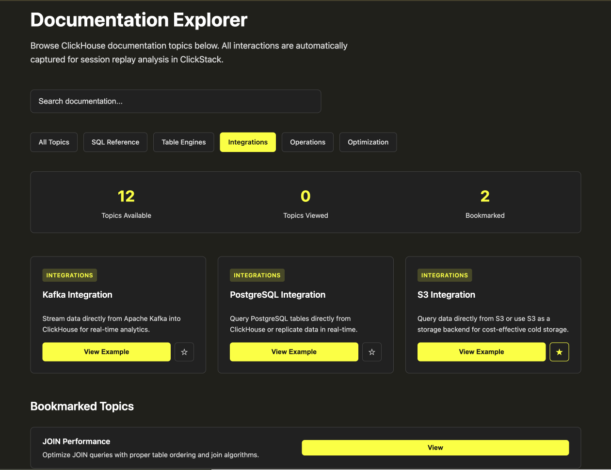
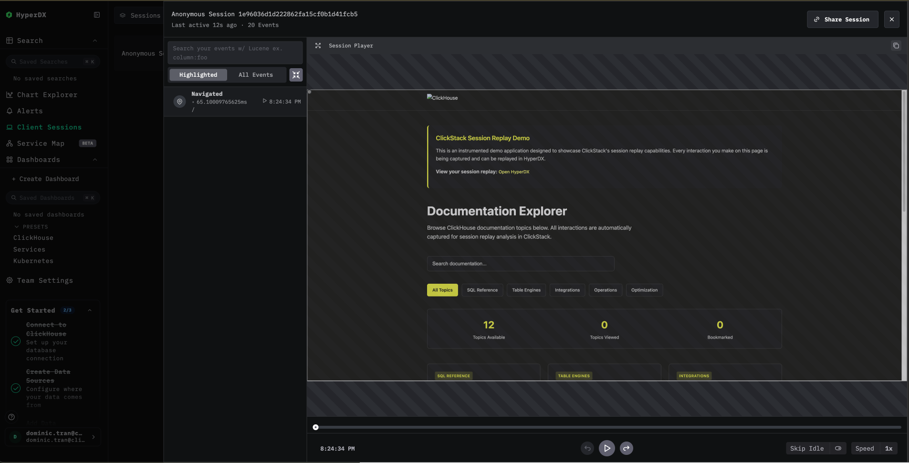

# ClickStack Session Replay Demo

An interactive demo showing how to instrument a web application for session replay with ClickStack.
This demo shows how easy it is to add session replay to any web application.

For a pre-instrumented version of the app, checkout the `pre-instrumented` branch. If running the pre-instrumented branch, see [Instrumentation](#instrumentation)

## Quick Start

### 1. Start ClickStack
```bash
docker-compose up -d clickstack
```

### 2. Get Your API Key

1. Open http://localhost:8080
2. Create a user account
3. Go to **Team Settings → API Keys**
4. Copy your **Ingestion API Key**

### 3. Start the Demo App
```bash
export CLICKSTACK_API_KEY='your-api-key-here'
docker-compose --profile demo up demo-app
```

### 4. Try It Out

1. **Use the app**: http://localhost:3000
   - Search for documentation topics
   - Filter by category
   - View code examples
   - Bookmark topics


   
2. **View the replay**: http://localhost:8080
   - Navigate to **Client Sessions**
   - Adjust your timeframe to include your session (likely last "15 minutes")
   - Find your session
   - Click ▶️ to replay



## Fully managed ClickHouse Observability

Use an existing fully managed service instead of starting local ClickStack. In your service, open **Team Settings → Managed Telemetry** and copy the OTLP HTTP endpoint and API key.

```bash
export CLICKSTACK_OTEL_ENDPOINT='https://YOUR_OTEL_ENDPOINT:4318'
printf "API key: "
read -r -s CLICKSTACK_API_KEY
printf "\n"
export CLICKSTACK_API_KEY
docker compose --profile demo up --build --no-deps demo-app
```

Keep the `https://` prefix and omit signal paths such as `/v1/traces`. `--no-deps` starts only the demo app, without the local ClickStack service. Open http://localhost:3000, interact with the app, then open **Client Sessions** in your managed service to view the replay. The service name is `clickhouse-session-replay-demo`.

The browser receives the endpoint and ingestion API key, so use a test service for this demo. Stop the app with `Ctrl+C`, and close its browser tabs to stop browser telemetry.

When `CLICKSTACK_OTEL_ENDPOINT` is unset, the app uses `http://localhost:4318` for the local setup above.

## Instrumentation

### 1. Include the SDK (`app/public/index.html`)

```html
<script src="https://unpkg.com/@hyperdx/browser@0.21.0/build/index.js"></script>
```

### 2. Initialize ClickStack (`app/public/js/app.js`)

```javascript
window.HyperDX.init({
  url: window.CLICKSTACK_CONFIG.endpoint,
  apiKey: window.CLICKSTACK_CONFIG.apiKey,
  service: 'clickhouse-session-replay-demo',
  consoleCapture: true,
  advancedNetworkCapture: true,
});
```

## Troubleshooting

### Sessions Not Appearing in HyperDX

1. Check browser console (F12) for errors
2. Verify ClickStack is running: `docker-compose ps`
3. Confirm API key is set: `echo $CLICKSTACK_API_KEY`
4. Hard refresh the browser: `Cmd+Shift+R` (Mac) or `Ctrl+Shift+R` (Windows/Linux)

### 401 Unauthorized Errors

The API key isn't set correctly. Make sure you:
1. Exported it in your terminal: `export CLICKSTACK_API_KEY='your-key'`
2. Started the demo app in the **same terminal** where you exported it
3. Got the key from HyperDX UI (not a random string)

## Cleanup

Stop the services:

```bash
docker-compose down
```

Remove all data:

```bash
docker-compose down -v
```

## Learn More

- [ClickStack Documentation](https://clickhouse.com/docs/use-cases/observability/clickstack)
- [Browser SDK Reference](https://clickhouse.com/docs/use-cases/observability/clickstack/sdks/browser)
- [ClickStack Getting Started](https://clickhouse.com/docs/use-cases/observability/clickstack/getting-started)
- [ClickStack Sample Datasets](https://clickhouse.com/docs/use-cases/observability/clickstack/sample-datasets)
